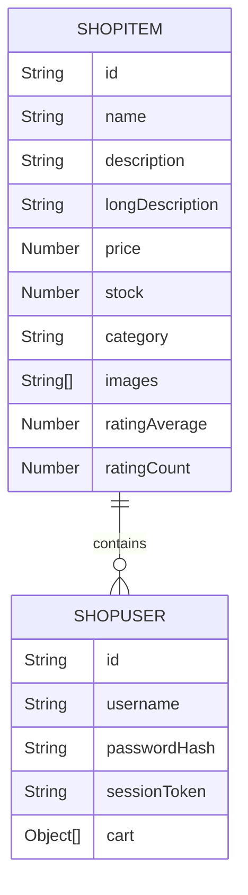

# Sam's Shop Simulator

## What Is This!?

Mr. Sam asked me to make him a shop simulator for demonstration purposes, I did that within 12 hours. This is that website! He said he'd only use it for this one thing though and I don't want my 12 hours of development to go to waste so I figured I'd make it open source.

## How Was This Made?

How was this made? 

Frontend: 
- TSX (TypeScript + XML)
- CSS (Classic)
- TypeScript (Compiled, Duh)

Backend:
- Bun (Runtime)
- Elysia (Web Routing Framework)
- TypeScript (Compiled in prod)
- MongoDB (Database)

## How Do I Run This?

### Prerequisites:
- NodeJS
- Bun
- MongoDB database

### Steps To Run:
1. Clone the repository
2. Copy and paste `.env.example` and rename to `.env` (customize if needed)
3. Run `bun install` to install dependencies

> Steps for development / local use:
4. Run `bun qstart` to quick start (compiles frontend, leaves backend uncompiled)

> For production envrionment:
4. Run `bun build` to build both the frontend and backend
5. Run `bun start` to start the server

## For Funsies

Here's the database's ERD (It's a MongoDB database and traditionally has no relationships, duh, but still fun to make):

*Note: Cart should really only hold references to the item it's holding, not "Objects" the full item.. that is bad! But I didn't have time to fix that cause I speedran this website!*

## Can I Use This?

Yes! You can use this for whatever you want, just make sure to give credit where it's due. I'd appreciate it if you could also star this repository if you found it useful.